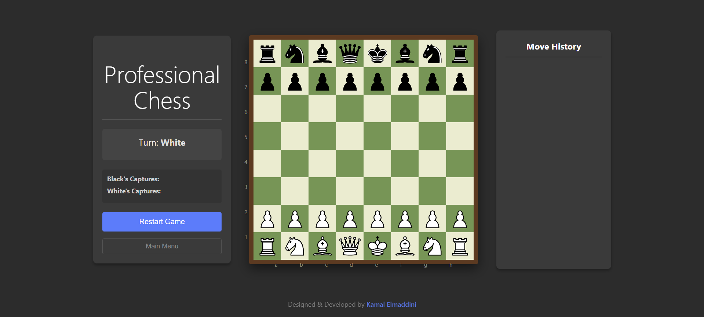

# ♟️ Modern React Chess Game

A fully functional, interactive chess game built with React.js and Vite. This project features a modern UI, move validation, and game state management.

 *(Note: Add a screenshot of your game here)*

## ✨ Features

- **Complete Chess Logic**: Supports all standard chess moves including castling, en passant, and promotion.
- **Move Validation**: Highlights legal moves for selected pieces.
- **Captured Pieces**: Visual tracking of captured pieces for both sides.
- **Game Status**: Automatic detection of Check, Checkmate, and Stalemate.
- **History Tracking**: Undo/Redo functionality (if implemented) or move history.
- **Responsive Design**: Playable on different screen sizes.

## 🛠️ Technologies Used

- **React 18**: For building the user interface.
- **Vite**: For fast development and building.
- **JavaScript (ES6+)**: Core game logic and engine.
- **CSS3**: Styling the board and pieces.

## 🚀 Getting Started

### Prerequisites

- Node.js (v14 or higher)
- npm or yarn

### Installation

1. Clone the repository:
   ```bash
   git clone https://github.com/KamalElmaddini/chess-game.git
   ```

2. Navigate to the project directory:
   ```bash
   cd chess-game
   ```

3. Install dependencies:
   ```bash
   npm install
   ```

4. Start the development server:
   ```bash
   npm run dev
   ```

5. Open [http://localhost:5173](http://localhost:5173) to play!

## 🤝 Contributing

Contributions are welcome! Feel free to open issues or submit pull requests.

## 📄 License

This project is open source and available under the [MIT License](LICENSE).
